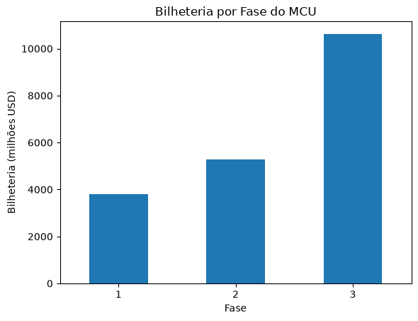
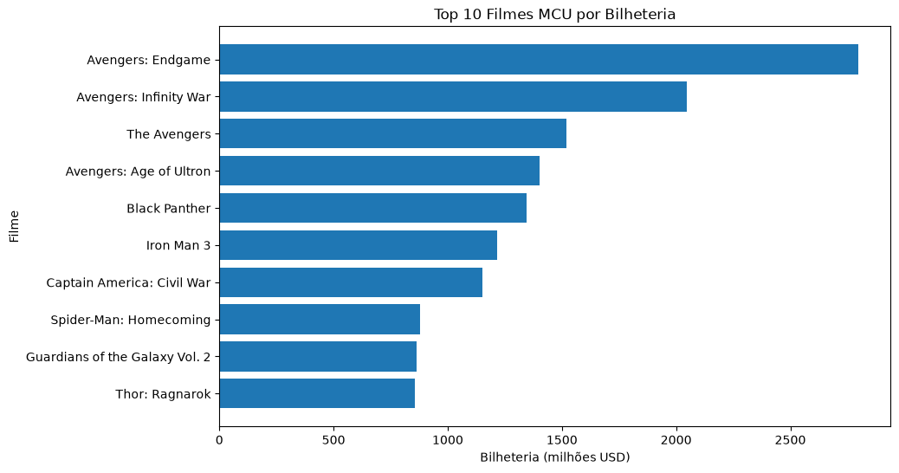
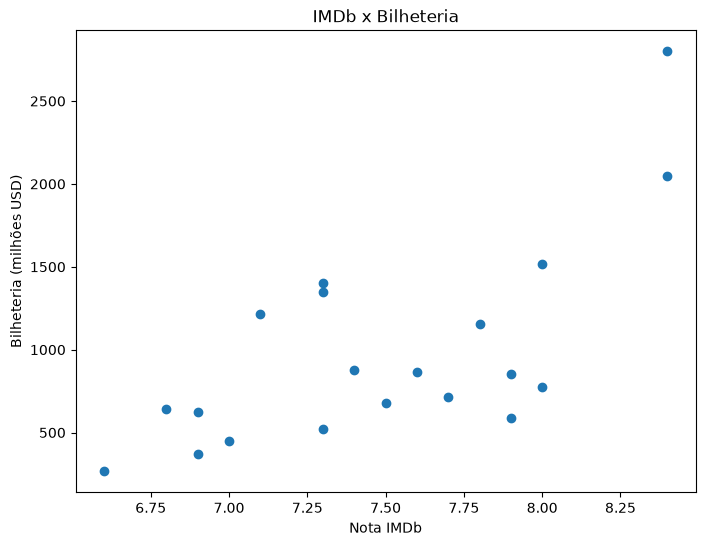

# Análise de Bilheteria do MCU

Projeto de análise de dados dos filmes do Universo Cinematográfico Marvel (MCU), explorando bilheteria, avaliações e padrões ao longo das fases.

---

## Objetivo

- Evolução da bilheteria por fase
- Relação entre nota IMDb e sucesso financeiro
- Ranking dos filmes mais lucrativos
- Eficiência de arrecadação por nota

---

## Tecnologias

- Python
- Pandas
- Matplotlib

---

## Estrutura do projeto

```
MarvelAnalyticsDashboard/
│ 
├── data/
│   └── marvel_movies.csv
│ 
├── images/
│   ├── bilheteria_por_fase.png
│   ├── imdb_vs_bilheteria.png
│   └── top10_bilheteria.png
│ 
├── notebooks/
│   └── analise_marvel.ipynb
│ 
├── .gitignore
└── README.md
```

---

## Análises realizadas

**Bilheteria por fase**
Evolução do faturamento do MCU ao longo das fases, mostrando o crescimento da franquia.

**Top 10 filmes**
Ranking dos filmes com maior bilheteria global.

**Correlação IMDb vs. Bilheteria**
Análise da relação entre avaliação do público e sucesso financeiro.
Correlação encontrada: **0.68** (moderada positiva).

**Eficiência**
Quanto cada filme arrecadou por ponto de nota IMDb.

---

## Exemplos de gráficos

### Bilheteria por fase


### Top 10 filmes


### Correlação IMDb vs. Bilheteria


---

## Como rodar

1. Clone o repositório:

```bash
git clone https://github.com/scalabrinibruna/MarvelAnalyticsDashboard
```

2. Instale as dependências:

```bash
pip install pandas matplotlib
```

3. Abra o notebook:

```bash
py -m notebook
```

---

## Autora

Bruna Scalabrini — Engenharia de Software, PUC Minas
[LinkedIn](https://www.linkedin.com/in/bruna-scalabrini-7b58913a0/?skipRedirect=true) 
[GitHub](https://github.com/scalabrinibruna)